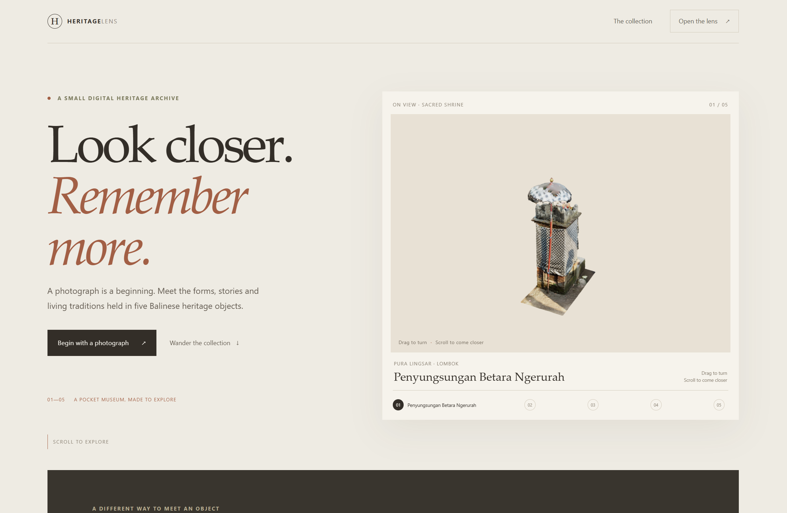

# HeritageLens - Demo

HeritageLens is a local-first image recognition and 3D viewer for five heritage objects from Bali and Lombok(for now). Upload a photograph to find a supported object, inspect its local 3D model, and read a short cultural record.



The application uses React, TypeScript and Three.js in the browser, with a Flask API for image recognition. CLIP is the default embedding model. DINOv3 and SAM 3 are optional.

## What it does

- Match a JPG, PNG or WEBP photograph against five registered objects.
- Return an unknown result when a match does not meet the configured threshold.
- View and rotate local GLB models in the browser.
- Read object descriptions, historical context, material and location.
- Run locally after preparing the reference images, model weights and GLB files.

## Requirements

- Python 3.12
- Node.js 18 or later with npm
- Internet access for package installation and the initial CLIP model download (well it depends on how you install it and how you want to use it)
- CUDA and an authorized SAM 3 checkpoint for optional segmentation

Recognition runs on CPU. SAM 3 is not required for object matching or 3D viewing.

## Installation

### Windows PowerShell

From the project root:

```powershell
py -3.12 -m venv .venv
.\.venv\Scripts\Activate.ps1
python -m pip install --upgrade pip
python -m pip install -r requirements.txt
Copy-Item .env.example .env
```

### Windows Git Bash

From the project root:

```bash
py -3.12 -m venv .venv
source .venv/Scripts/activate
python -m pip install --upgrade pip
python -m pip install -r requirements.txt
cp .env.example .env
```

### macOS and Linux

```bash
python3 -m venv .venv
source .venv/bin/activate
python -m pip install --upgrade pip
python -m pip install -r requirements.txt
cp .env.example .env
```

Install frontend dependencies from the project root on any platform:

```bash
cd frontend
npm install
npm run build
cd ..
```

## Local assets and offline use

The public source repository excludes reference photographs, generated embeddings, GLB files, model weights and runtime outputs. Reference photos and GLBs are local assets; confirm permission and license terms before redistributing them.

Add one to five reference images that you are authorized to use to each `data/objects/object-0N/refs/` directory. Add the corresponding GLB file to `frontend/public/models/` using these filenames:

```text
object-01.glb
object-02.glb
object-03.glb
object-04.glb
object-05.glb
```

Each model path in `data/objects/object-0N/object.json` must match its file. The GLB should contain its texture images. Object records retain the creator, source and license fields; verify each model's current terms before use or redistribution.

Generate reference embeddings while online:

```bash
python scripts/build_embeddings.py
```

The script downloads public CLIP weights if they are not already cached and writes vectors to `data/embeddings/`. The Flask application runs Transformers in offline mode, so the weights must be cached on the same computer before disconnecting from the internet. Rebuild embeddings when the reference images or embedding model changes. Do not mix CLIP and DINOv3 vectors.

## Run locally

Start Flask from the project root in the first terminal:

```bash
python backend/app.py
```

Start Vite from the project root in a second terminal:

```bash
cd frontend
npm run dev
```

Open [http://localhost:5173](http://localhost:5173). Vite proxies `/api` and `/outputs` to Flask on port 5000.

Create the production frontend bundle with:

````bash
cd frontend
npm run build

## SAM 3

SAM 3 segmentation is optional and is not included in the standard dependencies. Without a configured SAM 3 installation and checkpoint, recognition and 3D viewing remain available. See the [official SAM 3 repository](https://github.com/facebookresearch/sam3) for current installation requirements.

## Project structure

```text
backend/                  Flask API and recognition services
data/objects/             Object records and local reference directories
data/embeddings/          Generated image vectors
frontend/src/             React application
frontend/public/models/   Local GLB files
outputs/                  Runtime uploads and segmentation results
scripts/                  Dataset validation and embedding generation
````
